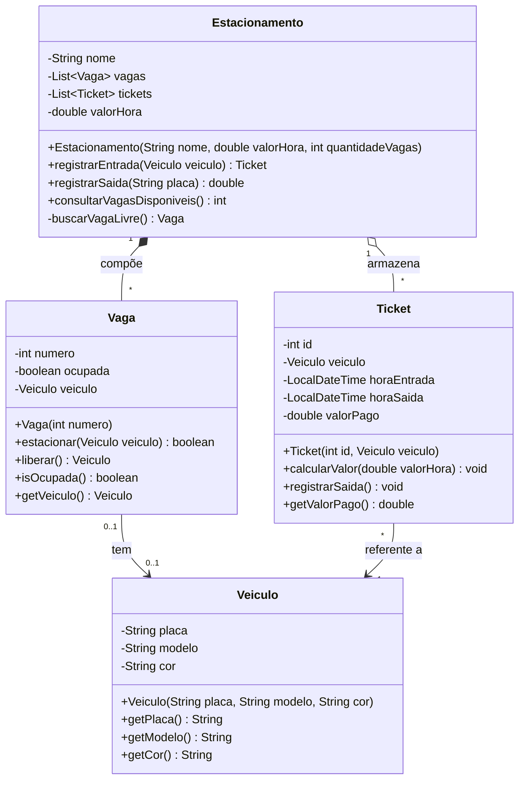

# Diagrama de Classes - Sistema de Estacionamento

## Detalhes da Implementação

### Relacionamentos
1. **Estacionamento -> Vaga**: Composição (*--). O estacionamento é composto por vagas. Se o estacionamento deixar de existir, as vagas também deixam.
2. **Estacionamento -> Ticket**: Agregação (o--). O estacionamento mantém um histórico de tickets.
3. **Vaga -> Veiculo**: Associação simples. Uma vaga pode ter um veículo ou estar vazia (0..1).
4. **Ticket -> Veiculo**: Associação unidirecional. O ticket precisa saber a qual veículo se refere.

### Encapsulamento
- Todos os atributos definidos como privados (`-`).
- Métodos de acesso e operações principais definidos como públicos (`+`).
